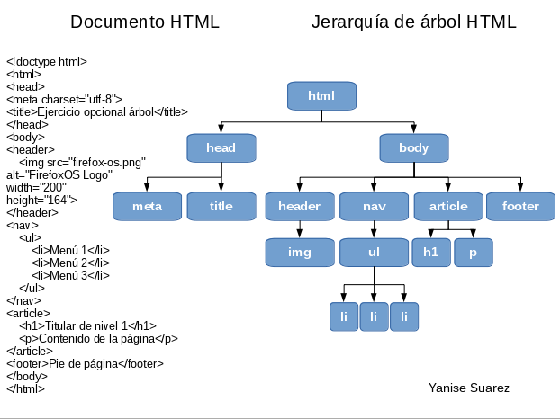
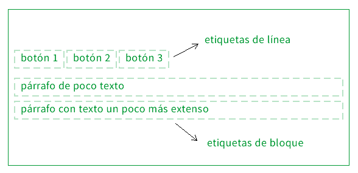

# Clase 01 - HTML y como funciona HTML 

## Conceptos previos para entender HTML

**HTTP (ES EL TRADUCTOR)**: Hypertext Transfer Protocol Es el protocolo que permite la comunicacion entre la solicitud realizada por el cliente (navegador) 
y el servidor (que contiene los documentos con la informacion solicitada). 

**Cliente (ES EL EMISOR)**: Es la herramienta que actúa en representación del usuario (Navegadores, Aplicaciones de testing como postman)

**Servidor (ES EL RECEPTOR**: Es el que entregas todo el documento que ha sido pedido. (cache, bases de datos, correos, HTML)

### Como funciona el navegador (HTTP, Cliente y Servidor)


## Que es HTML (HyperText Markup Language - Lenguaje de Marcas de Hipertexto)?
- ***QUE ES?*** Es un documento en el que podemos definir contenido ordenado (parrafos, titulos) a través de etiquetas semánticas.
- ***PARA QUE SIRVE?*** Es un lenguaje de marcado que se utiliza para el desarrollo de páginas web.
- **CON QUE LO COMPARO** Es como tener un lápiz y una Hoja Blanca ONLINE o en la web.

## Como funciona HTML?

### Arquitectura
HTML funciona a través de las marcas denominadas ***ETIQUETAS*** que son definidas dentro de los signos `<` y `>`.


***TIPS IMPORTANTES DE LAS ETIQUETAS***
- Recuerden abrir y cerrar siempre las etiquetas (Para evitar comportamientos visuales extraños y funcionamiento incorrecto). 
- No se pueden crear etiquetas nuevas o personalizadas (Se deben seguir los estandares por la página de la [W3C](https://www.w3.org/) o [WHATWG](https://whatwg.org/))
- No usar mayusculas (Todas las etiquetas se escriben en minusculas)
- Pocas etiquetas como `img`, `hr`, `input` son llamadas etiquetas vacias ya que *NO* poseen etiqueta de cierre. *Ejm*:
```
 => Imagen
<hr />  => Linea Horizontal
<input type="text" /> => Campo de Texto
```
Las etiqueras pueden tener `atributos` (Forma de extender la funcion de la etiqueta o contienen información adicional)


***TIPS IMPORTANTES DE LOS ATRIBUTOS***
1. El nombre del atributo es seguido por un signo de igual `=`.
2. Comillas de apertura y de cierre, encerrando el valor del atributo.
3. Se definen entre espacios si posee diversos atributos.
```
Ejm:
<etiqueta atributo1='valor1' atributo2='valor2'> mi contenido...</etiqueta>

Ejm Real:
<a class="estilo-enlace" href="http://google.com/" target="_blank"> Mi enlace </a>
```

#### Estructura Base de un Documento HTML:
para crear un archivo HTML se debe crear un archivo con extension `.html` y debe poseer la siguiente estructura:

    <!DOCTYPE html> => Etiqueta para indicar el tipo documento (Para este caso HTML5)
    <html> => Documento Raíz de HTML primer elemento del DOM
        <head> => Cabecera del Documento HTML (Aquí van los metadatos (palabras claves), archivos externos linkeados (como css, js y otros...)
            <title>Titulo de la Pestaña del Navegador</title>
        </head>
        <body> => Cuerpo del Documento HTML (Esta etiquera es donde se crea todo el contenido web)
        </body>
    </html>

### Jerarquía
HTML es un se comporta de manera Jerárquica, es decir, funciona como un árbol genealógico. Esto quiere decir que existen etiquetas o marcas que pueden definirse unas dentro de otras.

***TIPS Jerarquía***
- Debe respetarse el orden de cierre no se debe realizar anidaciones incorrectas
```
<h2>
    Esto es un <span> titulo</h2> => INCORRECTO
</span> 

<h2>
    Esto es un <span>titulo</span> => ESTO ES LO CORRECTO
</h2> 
```



Ejemplo Genealógico:
```
<div> // PADRE DE H2 Y H3 - ABUELO DE SPAN 
    <h2>Mi titulo</h2> // HIJO
    <h3> // HIJO DE DIV - HERMANO DE H2
        Este es mi 
        <span>Subtitulo</span> // NIETO DE DIV - HIJO DE H3 
    </h3> 
</div>
```

### Comportamiento del Tipo de `Etiquetas`
Existen dos tipos de comportamiento por defecto para las etiquetas HTML que se encuentran dentro del `body`:
1. Las que se comportan como **BLOQUE** que ocupan todo el espacio del viewport (Espacio disponible del navegador).
    - Estas ocupan todo el espacio y a nivel visual empujan al siguiente elemento a la linea de abajo.
2. Las que se comportan como **INLINE** que ocupan solo su contenido. 
    - Estas se colocan al lado del elemento Sí tambien son inline.

Ejemplo del comportamiento



### ORIENTACION FINAL
Como pueden observar HTML es un lenguaje sencillo *NO requiere de aprenderse cada etiqueta sino conocer verdadero su uso*, es por ello que los invito a seguir probando etiquetas en páginas de referencias como el [Tutorial HTML W3schools](https://www.w3schools.com/html/).

La ruta de aprendizaje HTML que invito a realizar es: 

1. Etiquetas de Semantica Web (main, footer, header, nav, section, headings)
2. Etiquetas de Formato de Textos (b, i , mark, strong, u, etc...)
3. Imagenes y Multimedia (a, img, video, picture, etc..)
4. Tablas y Formularios (table, td, tr, input, select, etc...)
5. Contenido Embebido (iframe, object, embed, etc)

## LUEGO DE ESTO CONTINUA TU TRAVESÍA POR CSS (DALE COLOR A TU DOCUMENTO DE BLANCO Y NEGRO A COLOR) [Click Aqui](clase-2.md).