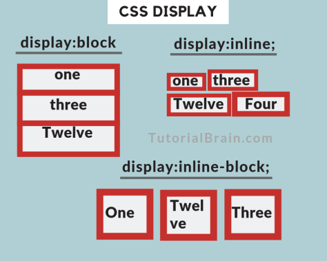
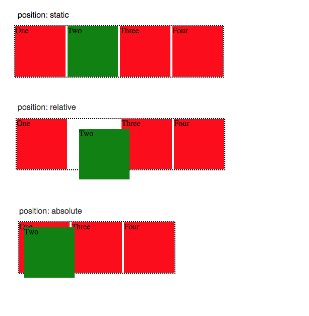
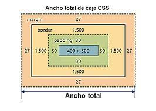

# Clase 02 - CSS (a darle color a nuestro Documento HTML)

## Que es CSS (del inglés Cascading Style Sheets)?
- ***QUE ES?*** Es un lenguaje que define reglas para darle estilos a un elemento web.
- ***PARA QUE SIRVE?*** se usa para estilizar (darle un mejor aspecto gráfico) a elementos de HTML.
- **CON QUE LO COMPARO** Con Colores, pegas y marcadores (HTML es el Lienzo) y CSS son las herramientas que pintan el lienzo.

### Definicion de CSS

## FUNDAMENTOS Basicos CLAVES PARA APRENDER CSS

- **Herencia o (inherit)**: Capacidad de poseer los mismas  y comportamiento entre elementos ancestros y descendientes (Padre Hijo - Abuelo - Nieto ...etc)

Ejm: en la imagen la etiqueta `h1` hereda la propiedad ``color`` de su ancestro (padre). por lo tanto se visualiza en color morado. 

- **Cascada**: Es el resultado final (estilo final) que muestra un elemento html de acuerdo a su última propiedad valor definida.

- **Selectores**: Es la forma de buscar un elemento html para darle estilos.

- **Especifidad**: Es la forma de otorgar un estilo a un elemento html de manera particular o especifica cumpliendo con un algoritmo (cálculo) que según su jerarquía será aplicado.

## FUNDAMENTOS Avanzados
###  `display` el Comportamiento de HTML (inline | block | inline-block)
La propiedad CSS `display` define si un elemento es tratado como bloque o linea.

- #### Elemento de Bloque `display: block`
El comportamiento de bloque permite que cada elemento por muy pequeño sea su contenido ocupará todo el espacio disponible del viewport, es decir, cada elemento se ubicará uno debajo del otro.

- #### Elemento de Línea `display: inline`
El comportamiento de linea permite que cada elemento solo se ajuste a su contenido.

- #### Elemento de Linea y Bloque (Ambos) `display: inline-block`
Este comportamiento permite combinar lo mejor de ambas propiedades en una (si es de linea podemos usar margin automaticos para centrar el elemento, tambien respetaria los width y height que no pueden ser usado en elementos inline).

### `position` EL Contexto - Elementos Posicionados  (static | relative | absolute | fixed | sticky)
En HTML todos los elementos tienen una posicion y un orden en que son posicionados. Para poder tener estructuras mas complejas, tenemos que discutir la propiedad position (posición). Esta propiedad tiene los siguientes valores:

- `static` => es el valor por defecto. Un elemento con position: static; no está posicionado en ninguna forma en específico. Se dice que un elemento static, está no posicionado y un elemento con valor establecido de position está posicionado.
- `relative` => se comporta de la misma forma que `static` pero podemos usar propiedades de elementos posicionados como `top`, `left`, `bottom`, `right`, `z-index`. También mantiene su espacio dentro del flujo (donde se imprime)

- `absolute` => Se comporta de acuerdo a su ancestro (padre, abuelo...etc) posicionado más cercano y pierde su espacio en el flujo a diferencia del `relative`. En resumidas cuentas es como una caja flotante.
- `fixed` =>  se posiciona de manera al viewport y se mantendrá en el mismo lugar incluso después de hacer scroll. Al igual que el `absolute` pierde su espacio.
- `sticky` =>  se posiciona de manera relativa a su posicion actual pero cambia a fijo si existe scroll

### Modelo de Caja (espacios internos y externos que tiene la web)
- Contenido => Comprende el width y heigth del elemento 
- Margenes Internos (padding). Margen que se calcula del border hacia dentro del contenido
- Margenes Externos (margin). Margen que se calcula del border hacia fuera del contenido
- Border = es el trazo de la caja.

