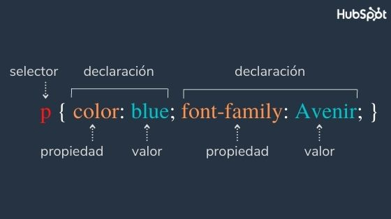
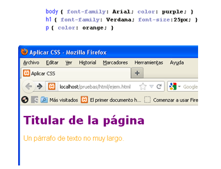
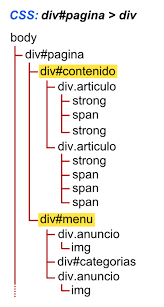

# Clase 02 - CSS (a darle color a nuestro Documento HTML)

## Que es CSS (del inglés Cascading Style Sheets)?
- ***QUE ES?*** Es un lenguaje que define reglas para darle estilos a un elemento web.
- ***PARA QUE SIRVE?*** se usa para estilizar (darle un mejor aspecto gráfico) a elementos de HTML.
- **CON QUE LO COMPARO** Con Colores, pegas y marcadores (HTML es el Lienzo) y CSS son las herramientas que pintan el lienzo.

### Definicion de CSS

## FUNDAMENTOS Basicos CLAVES PARA APRENDER CSS

- **Herencia o (inherit)**: Capacidad de poseer los mismas  y comportamiento entre elementos ancestros y descendientes (Padre Hijo - Abuelo - Nieto ...etc)

Ejm: en la imagen la etiqueta `h1` hereda la propiedad ``color`` de su ancestro (padre). por lo tanto se visualiza en color morado. 

- **Cascada**: Es el resultado final (estilo final) que muestra un elemento html de acuerdo a su última propiedad valor definida.

- **Selectores**: Es la forma de buscar un elemento html para darle estilos.

- **Especifidad**: Es la forma de otorgar un estilo a un elemento html de manera particular o especifica cumpliendo con un algoritmo (cálculo) que según su jerarquía será aplicado.

## FUNDAMENTOS Avanzados
- comportamiento (inline | block | inline-block)
- positions 
- flujo
- modelo de caja (espacios internos y externos que tiene la web)
