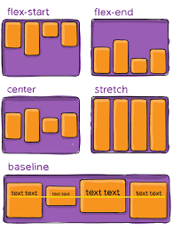
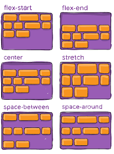

# Flexbox (Contexto de Caja Flexible)
El contexto de flexbox es un nuevo mecanismo para crear elementos flexibles, con una sintaxis limpia y sencilla mucho más inteligente de las que la realizamos con posicion y float. En resumidas cuentas Flexbox es un modelo que nos permite alterar el ancho, alto y posicionamiento de una caja con el espacio disponible.

## Cual es el uso de Flexbox
- Evitar el uso de float.
- Realizar cajas del mismo tamaño uniforme (altura y ancho).
- Centrado absoluto (Centrado horizontal y vertical).
- Con pocas propiedades posicionar diversos elementos aplicando una sintaxis sencilla.

## Como se define el contexto de flexbox

    selector {
        display: flex | inline-flex;
    }

## Actores que intervienen en Flexbox
- Flex Container (Alcance de Flexbox Contendor)
- Flex Item (Las verdaderas cajas flexibles)
- Eje principal (Main Axis => Eje Horizontal por defecto)
- Eje Secundario (Cross Axis => Eje Vertical por defecto)

## Estructura

## Propiedades que solo se utilizan en el flex container (Padre)
- `display: flex` = Define el contexto de flexbox 
- `flex-direction` = Cambia la direccion Main Axis y Cross Axis
    - 
- `flex-wrap` = Realiza saltos en los elementos (Si tienes width height definidos)
- `flex-flow` = Es un shorthand para usar `flex-direction` y `flex-wrap` en una sola instruccion.
- `justify-content` = Alinear elementos en el Main Axis (sea vertical o horizontal)
    - 
- `align-items` = Alinear elementos en el Cross Axis (sea vertical o horizontal)
    - 
- `align-content` = Alinea elementos por lineas si tiene definido la propiedad `flex-wrap: wrap`
    - 

# Referencias Web
[Flexbox Guide](https://css-tricks.com/snippets/css/a-guide-to-flexbox/)

